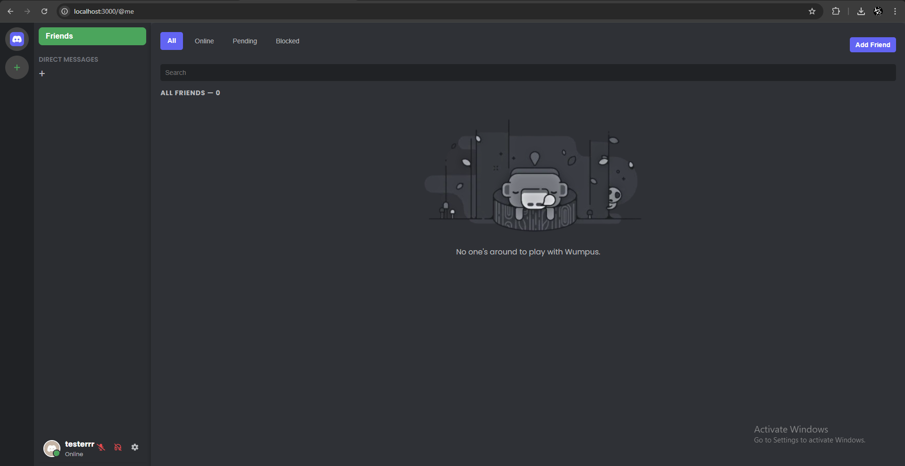

# Discord Clone - Midterm Project for CSIS279

## Project Overview

This project is a web-based chat application that mimics core functionalities of Discord, allowing users to create servers, channels, and engage in direct messaging (DM). The app supports user authentication, real-time messaging, friend management, and server customization. Built using **React** for the frontend and **Node.js with Express** for the backend, the application leverages **WebSockets** for real-time communication.

## Features

- **User Authentication**: Users can register, log in, and manage their accounts.
- **Server Management**: Users can create, edit, and delete servers.
- **Channel Management**: Users can create and manage channels within servers (text and voice channels).
- **Direct Messaging (DM)**: Users can send and receive direct messages in real-time.
- **Friendship System**: Users can send, accept, reject, and remove friends.
- **Real-Time Communication**: WebSocket integration for real-time chat updates.
- **Notifications**: Real-time notifications for incoming messages and friend requests.
- **Profile Customization**: Users can upload and update their profile picture and change their status.
- **Server Customization**: Users can upload an icon for servers and change their name.
- **Responsive Design**: Optimized for desktop and mobile use.

## Tech Stack

- **Frontend**:
  - React.js
  - React Router
  - Socket.io for real-time messaging
  - Axios for HTTP requests
  - React Toastify for notifications
  - CSS (Custom styling)

- **Backend**:
  - Node.js
  - Express.js
  - Sequelize (for ORM and database management)
  - MySQL (for the database)
  - Socket.io for real-time communication

- **Tools**:
  - JWT for authentication
  - bcryptjs for password hashing

## Installation

### Prerequisites

Ensure you have the following installed:

- Node.js (v14 or later)
- npm 
- MySQL or other relational database

### Steps

1. **Clone the repository**:
   ```bash
   git clone https://github.com/GeorgioMazraani/DiscordCloneMidterm-CSIS279-s1.git
   ```

2. **Navigate to the project directory**:
   ```bash
   cd midterm
   ```

3. **Install dependencies for the backend**:
   ```bash
   cd api
   npm install
   ```

4. **Install dependencies for the frontend**:
   ```bash
   cd app
   npm install
   ```

5. **Set up the database**:
   - Create a `.env` file in the `api` directory with the following content:
   ```env
   DB_HOST=127.0.0.1
   DB_PORT=3306
   DB_USER=root
   DB_PASSWORD=your-password
   DB_NAME=your-database-name
   JWT_SECRET=your-jwt-secret
   PORT=4000
   ```

6. **Start the backend server**:
   ```bash
   cd api
   nodemon index.js
   ```

7. **Start the frontend application**:
   ```bash
   cd app
   npm start
   ```

8. **Visit the app**:
   Open your browser and go to `http://localhost:3000`.

## Usage

- **Sign Up / Log In**: Users can register and log in using their credentials.
- **Create a Server**: Users can create a server with a custom name and icon.
- **Create Channels**: Users can create both text and voice channels.
- **Manage Friends**: Send and receive friend requests, chat with friends via DM.
- **Notifications**: Receive real-time notifications for new messages.

## Screenshots

**Login Page:**


**Home Page:**



**Chat Interface:**


**Channel Interface:**


## Contributing

Contributions are welcome! If you would like to contribute to this project, follow these steps:

1. Fork the repository.
2. Create a new branch for your feature or bugfix.
3. Make your changes and commit them.
4. Push your changes to your forked repository.
5. Open a pull request describing the changes you made.

### Code of Conduct

Please follow the code of conduct when contributing to the project. Treat everyone with respect, and maintain a welcoming environment.

## Acknowledgments

- **Socket.io**: For enabling real-time communication in the application.
- **React**: For providing an efficient and flexible front-end library.
- **Sequelize**: For making database interactions easier.
- **MySQL**: For being the relational database of choice for this project.
